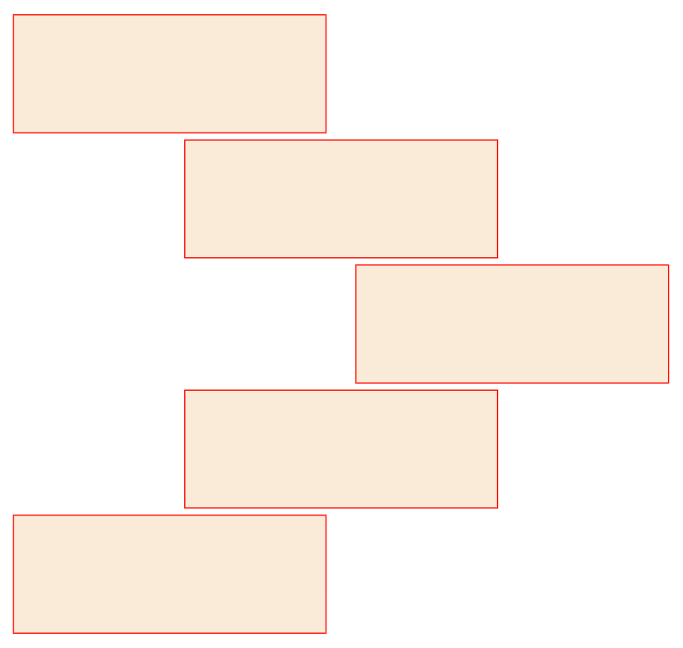
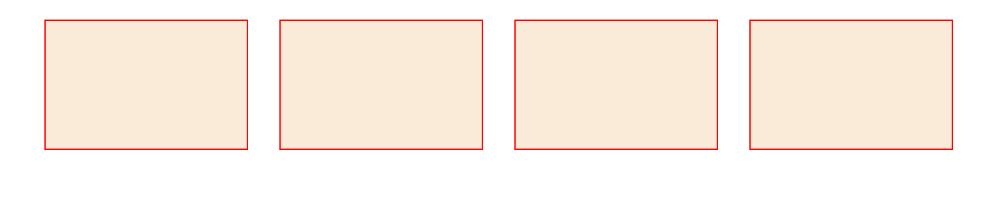
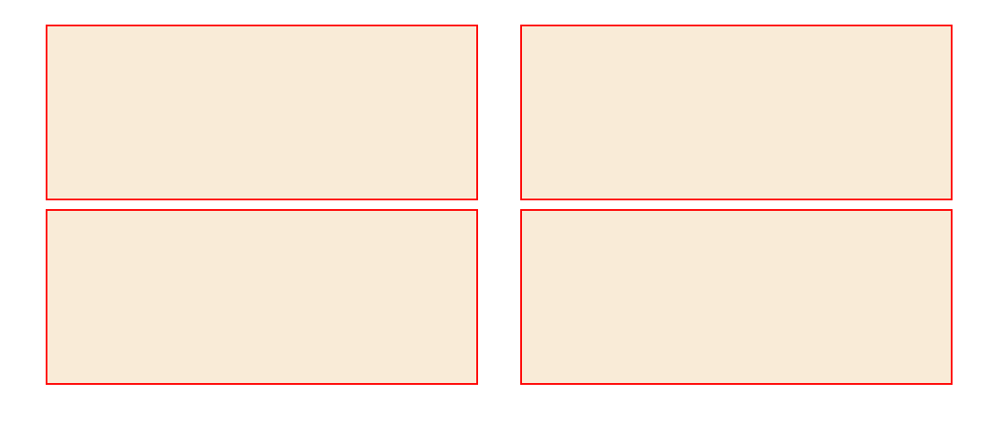
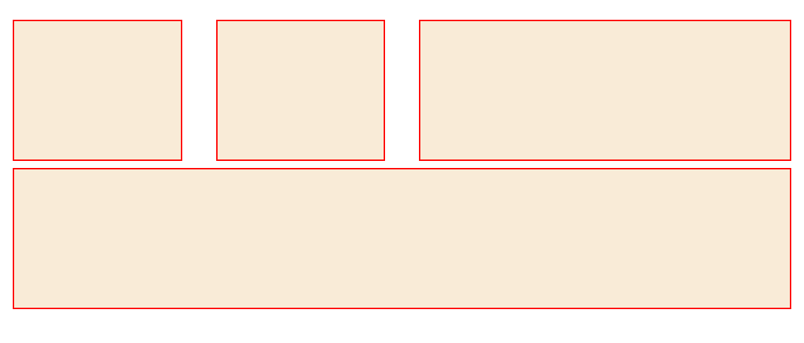

## 练习
目的：
- 阅读官方文档的能力
- flex 及 grid 知识点

## 练习 1: Bootstrap 的 Flex 练习
做出如下图所示的效果

## 练习 2: 断点与响应式练习
做出如下图所示的效果，三种不同断点显示不同的效果
### 1. Medium	md	≥768px

### 2. Small	sm	≥576px

### 3. Extra small	None	<576px
