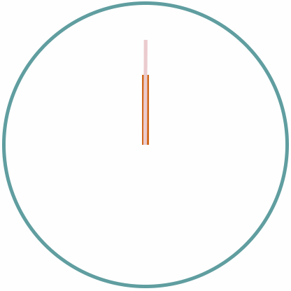

## 任务

### 任务1: 用刚学过的 Bootstrap 知识点完成个人网站首页
- 任务细节：
  - 文字和图片的显示顺序由 css 控制，html 结构都是左文字、右图片
  - 小屏幕下的显示效果：上文字、下图片

- 状态1：大屏的显示效果

- 状态2：小屏的显示效果

### 任务2：将 animate.css 应用到自己的页面

### 任务3：应用今天所学的知识，完成如下图所示的时钟练习
