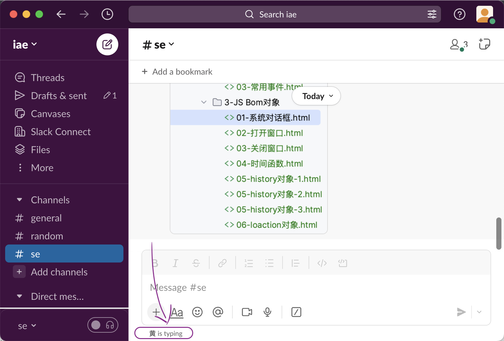
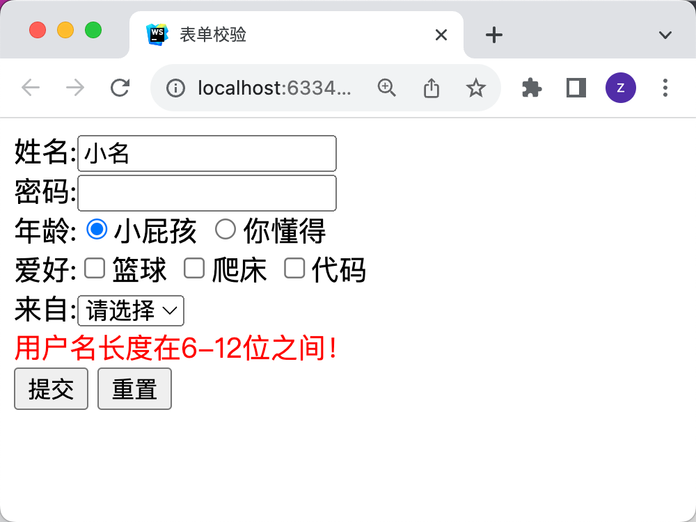

# 任务

## 任务1：用事件机制实现 `某某某正在输入`

## 任务2：完成表单校验
具体要求：
1. 验证用户名
    - 不能为空
    - 长度为 6-12 位
2. 验证密码
    - 不能为空 *
    - 长度为 6-12 位
    - 不能包含用户名
3. 年龄: 必须选择 你懂得
4. 爱好: 必须选择一项
5. 来自: 必须选择一项

满足以上条件
    - 弹出所有的内容
    - 提交表单
否则
    - 说明错误原因
    - 不能提交表单

