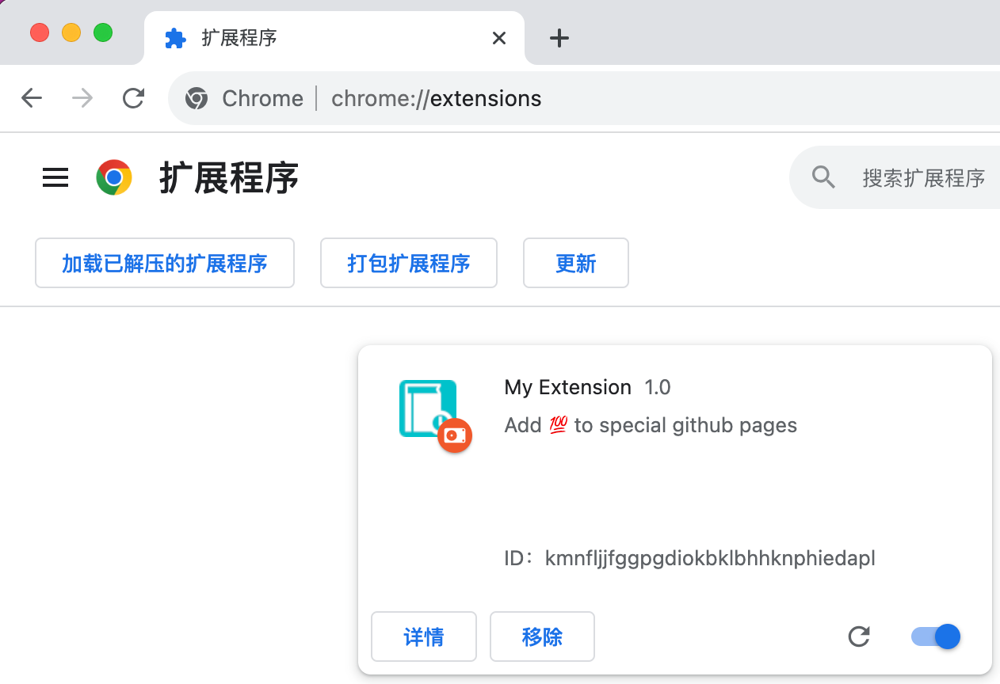
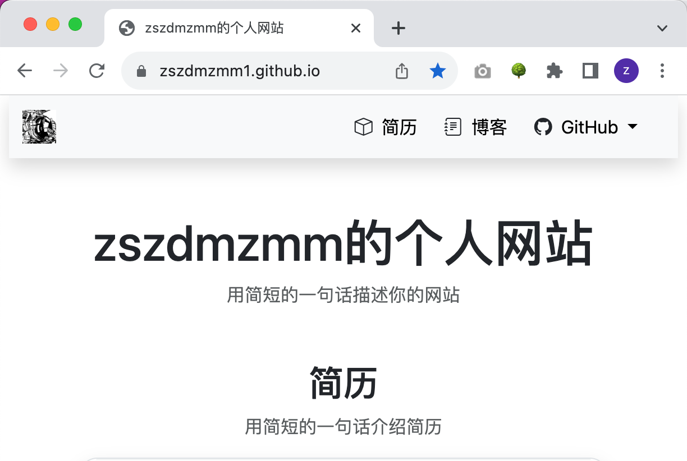
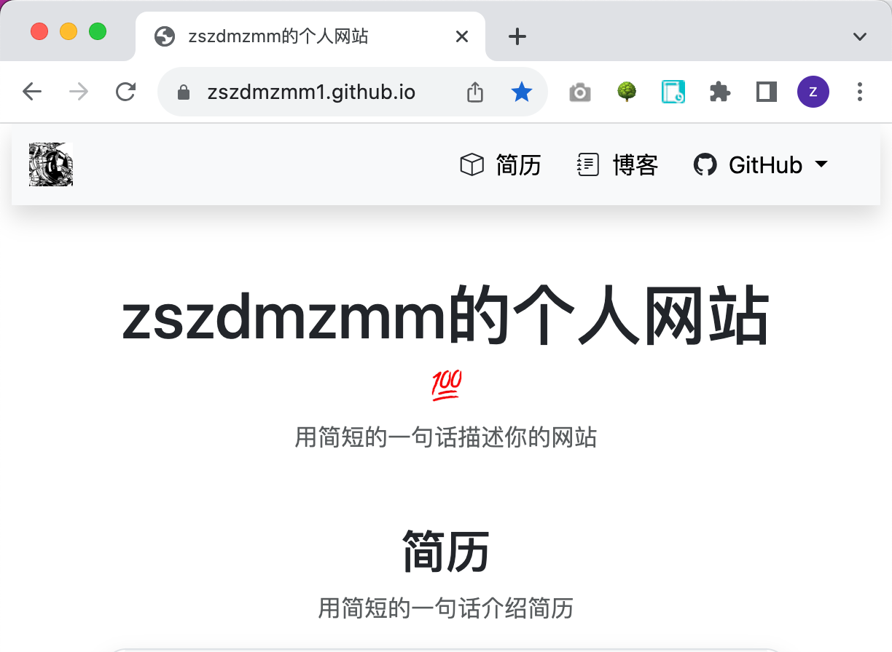
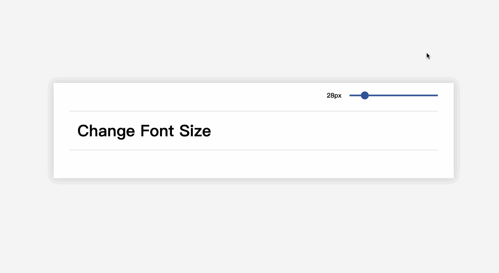
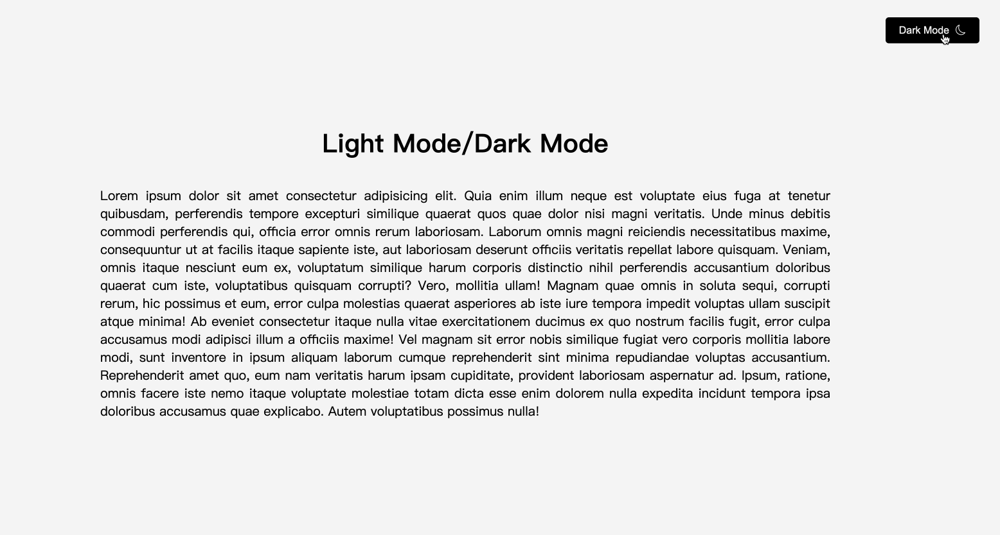

# 任务

## 任务1：在各自的个人主页上添加目前做过的所有代码仓库链接地址

## 任务2：开发一个自己的谷歌浏览器插件
功能要求：启用插件之后，访问任何的页面，只要页面中有 `h1` 标签，就在`h1`的后面显示💯

实现效果：
- 插件启用之前

- 启用插件

- 插件启用之后

## 任务3：通过 range 类型的 input 实时改变字体大小

## 任务4：切换浅色/深色模式

