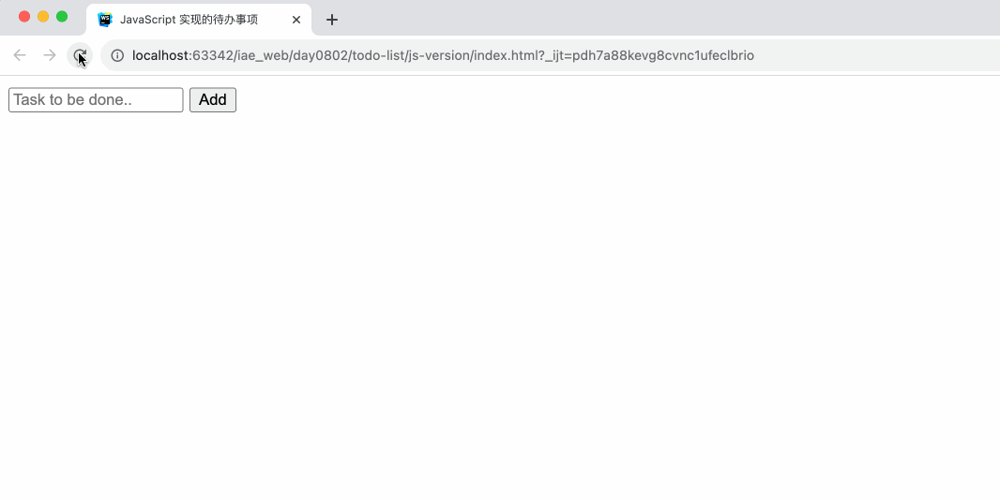

# 今日任务

目标：
- js 和 jQuery 知识综合应用
- 开发 Chrome 浏览器插件
- 锻炼调试、排错的能力
- 思路比知识点更重要

## 任务1：综合应用之前学习的 js 和 jQuery 知识点完成待办事项应用

任务细节
- 打开页面之后，输入框自动对焦
- 除了点击`Add`按钮之外，还可以通过回车键添加
- 如果输入的是空内容或者只有空格，弹窗提醒
- 可以删除任务
- 可以标记任务已完成
- 同时用原始的 js 和 jQuery 实现

## 任务2：写一个浏览器插件，屏蔽特定网站的广告内容

