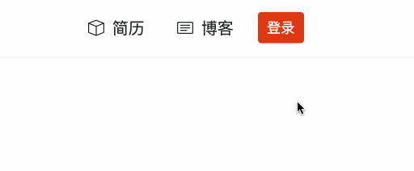
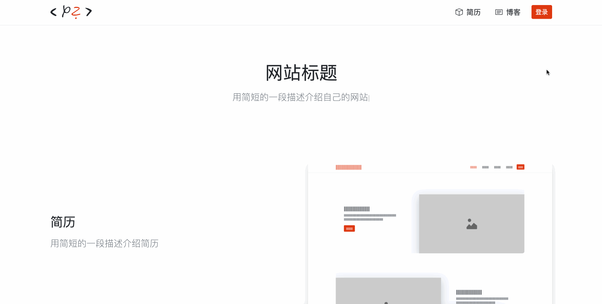
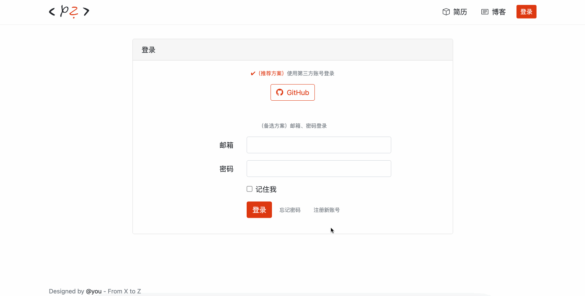
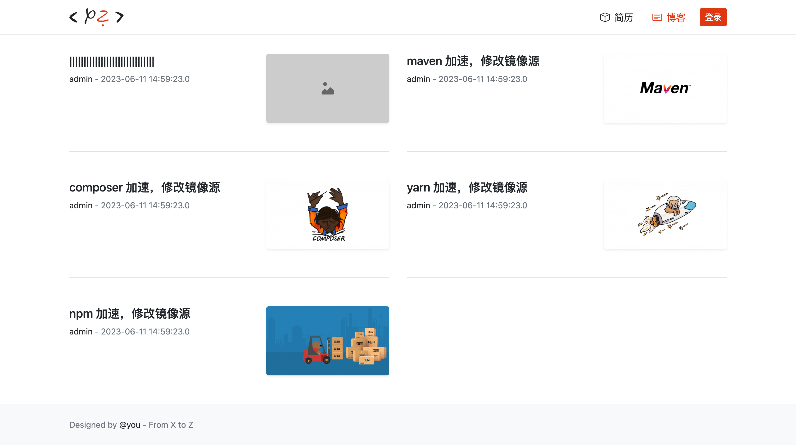

# 今日任务 day0803

目标：
- 通过几个页面复习 html、css、js、jquery 知识
- 为下周自己搭建后端服务做准备

## 任务1：完成昨天未完成的任务
...

## 任务2：个人网站的首页增加 `登录` 链接

## 任务3：增加 `登录` 页面

## 任务4：增加 `注册` 页面

## 任务5：增加 `文章列表页面` 页面

## 任务6：增加 `文章详情页面` 页面

