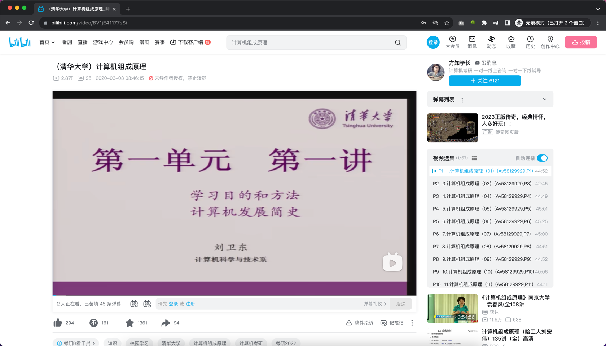

# 任务

## 任务1：实现一个 Chrome 浏览器插件

要求：计算B站视频合集页面的总时长

例：https://www.bilibili.com/video/BV1jE41177sS/

### Level-1
总共时长：xx小时xx分钟xx秒

### Level-2
剩余时长：xx小时xx分钟xx秒

计算当前观看的这节视频之后的所有视频时长总和

### Level-3（选做）:
把当前观看的这节视频的未看时长也计算到`剩余时长`中

实时计算

倍速也考虑进去

## 任务2：为这个浏览器插件做一个 Landing Page 页面

把它当产品来做，真正可上线，可在个人网站或者简历中展示

参考`沉浸式翻译`插件，设计这个插件的 Landing Page

https://immersivetranslate.com/

## 任务3：了解其他浏览器平台插件开发

自学 Firefox、Edge 浏览器插件开发，让这个功能也支持这些浏览器

## 其他：思考自己想实现的插件功能，当产品做它
