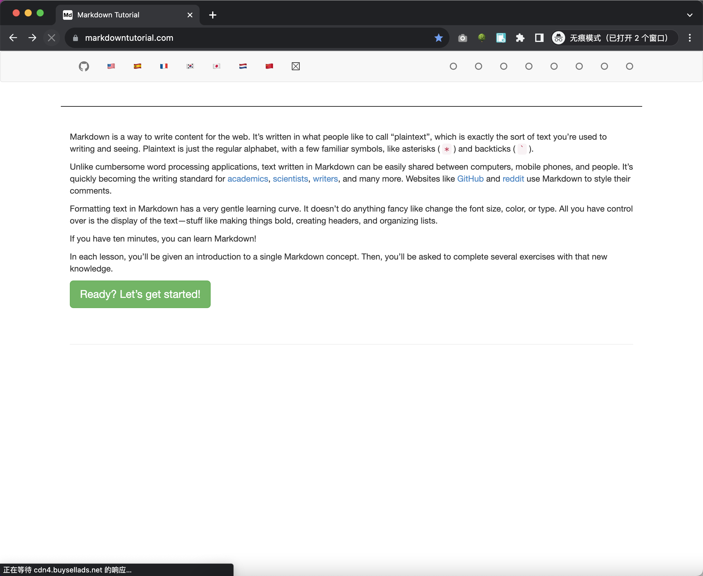
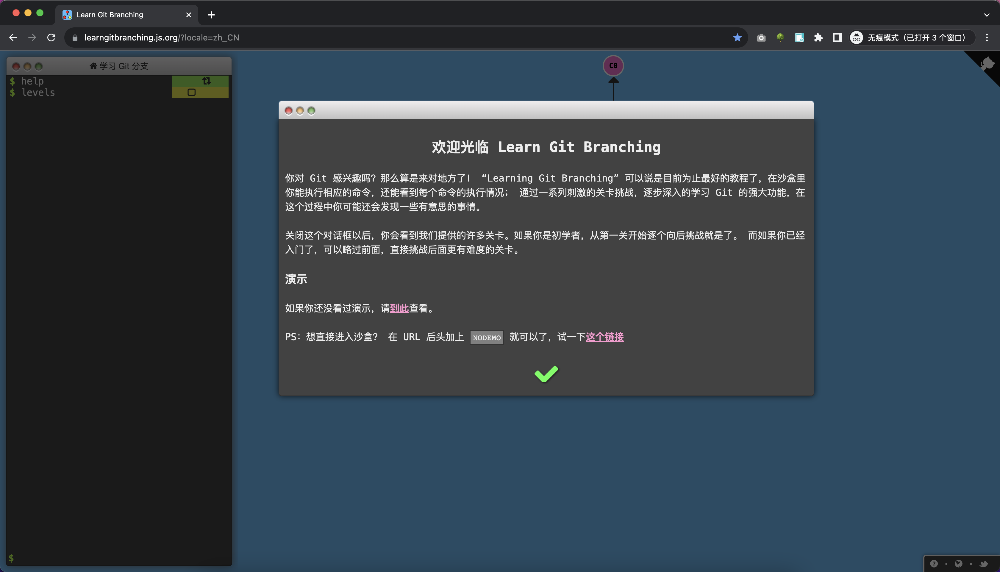
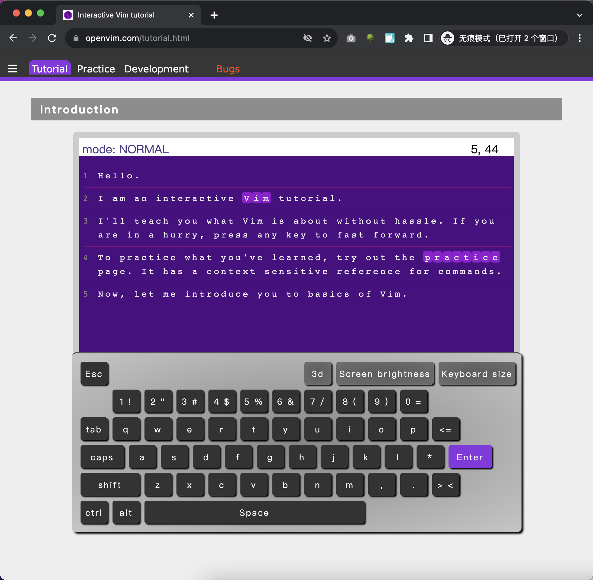

# 任务

## 1. 完善之前遗留下来的、待改进的点
比如：页面美化、功能完善等

## 2. markdown 在线练习
https://www.markdowntutorial.com/

## 3. git 在线练习
https://learngitbranching.js.org/

## 4. vim 在线练习
https://www.openvim.com/tutorial.html

